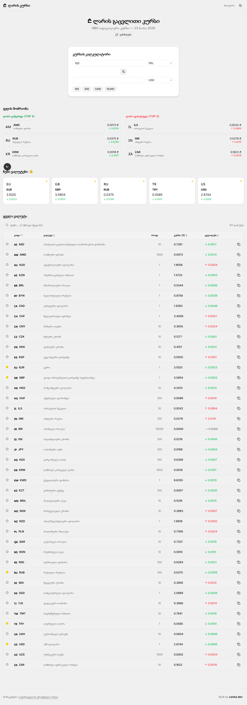
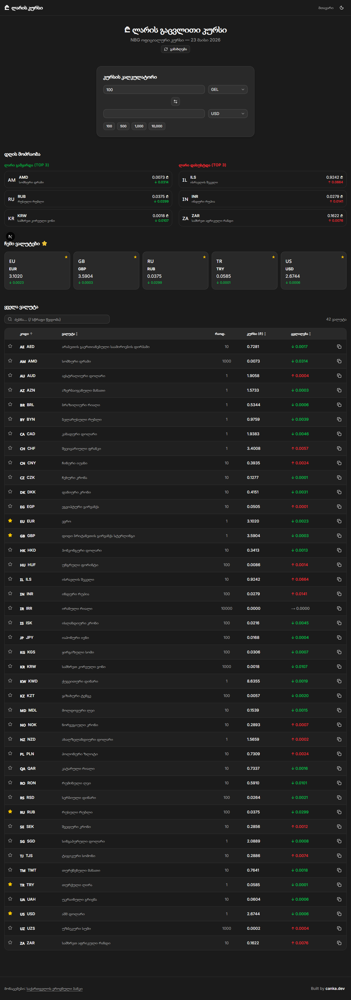
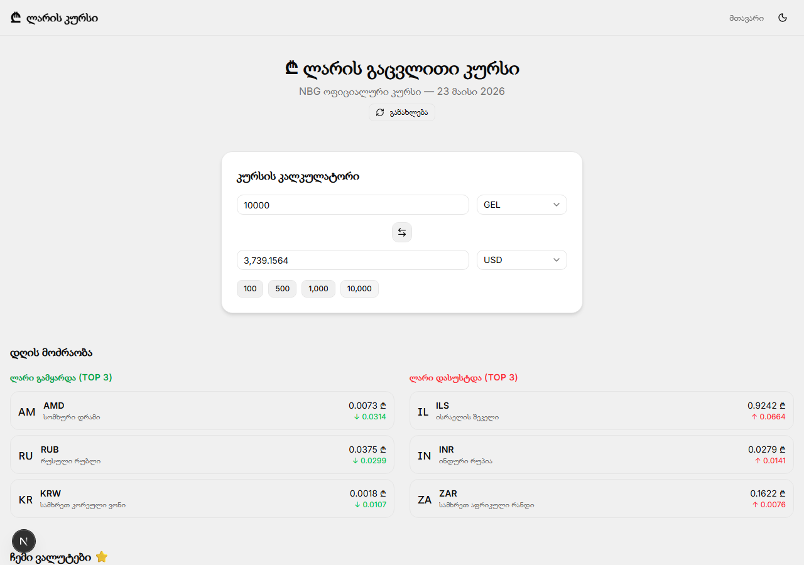

# ₾ ლარის კურსი

საქართველოს ეროვნული ბანკის (NBG) ოფიციალური გაცვლითი კურსი — რეალურ დროში, კალკულატორით და ისტორიით.

## სქრინშოტები

### Light Mode


### Dark Mode


### კურსის კალკულატორი


---

## ფუნქციები

- **ოფიციალური კურსი** — NBG API-დან ყოველ საათში განახლება
- **კურსის კალკულატორი** — ნებისმიერი ვალუტიდან GEL-ში და პირიქით, სწრაფი ღილაკებით (100 / 500 / 1,000 / 10,000)
- **დღის მოძრაობა (TOP 3)** — ყველაზე მეტად გამყარებული და დასუსტებული ვალუტები
- **ფავორიტები** — მონიშნე სასურველი ვალუტები, ინახება browser-ში
- **ყველა ვალუტა** — სრული ცხრილი ძებნით, დალაგებით და ფავორიტებად მონიშვნით
- **Dark / Light Mode** — სისტემის პარამეტრით ან ხელით გადართვა

---

## ტექნოლოგიები

| ტექნოლოგია | აღწერა |
|---|---|
| [Next.js 16](https://nextjs.org) | React framework (App Router) |
| [React 19](https://react.dev) | UI library |
| [Tailwind CSS v4](https://tailwindcss.com) | Utility-first CSS |
| [shadcn/ui](https://ui.shadcn.com) | UI components |
| [Recharts](https://recharts.org) | Chart library |
| [next-themes](https://github.com/pacocoursey/next-themes) | Dark/light mode |
| [date-fns](https://date-fns.org) | Date formatting |
| [lucide-react](https://lucide.dev) | Icons |

**მონაცემთა წყარო:** [NBG ოფიციალური API](https://nbg.gov.ge/gw/api/ct/monetarypolicy/currencies/ka/json)

---

## გაშვება

```bash
# 1. კლონირება
git clone https://github.com/NikTsanka/gel_exchange.git
cd gel_exchange

# 2. დამოკიდებულებების ინსტალაცია
npm install

# 3. Development სერვერის გაშვება
npm run dev
```

შემდეგ გახსენი [http://localhost:3000](http://localhost:3000)

### Production Build

```bash
npm run build
npm start
```

---

## პროექტის სტრუქტურა

```
gel_exchange/
├── app/
│   ├── api/currencies/   # NBG API route
│   ├── currency/         # ვალუტის დეტალური გვერდი
│   ├── ClientPage.tsx    # მთავარი client component
│   ├── page.tsx          # Server component (data fetching)
│   ├── layout.tsx        # Root layout
│   └── globals.css       # Global styles & theme tokens
├── components/
│   ├── Calculator.tsx    # კურსის კალკულატორი
│   ├── CurrencyTable.tsx # ვალუტების ცხრილი
│   ├── Favorites.tsx     # ფავორიტი ვალუტები
│   ├── TopMovers.tsx     # დღის მოძრაობა
│   ├── HistoryChart.tsx  # კურსის ისტორიის გრაფიკი
│   └── ui/               # shadcn/ui components
└── lib/
    ├── types.ts          # TypeScript types
    ├── currency-utils.ts # კონვერტაციის ლოგიკა
    └── flags.ts          # ვალუტის დროშები
```

---

## ლიცენზია

MIT
